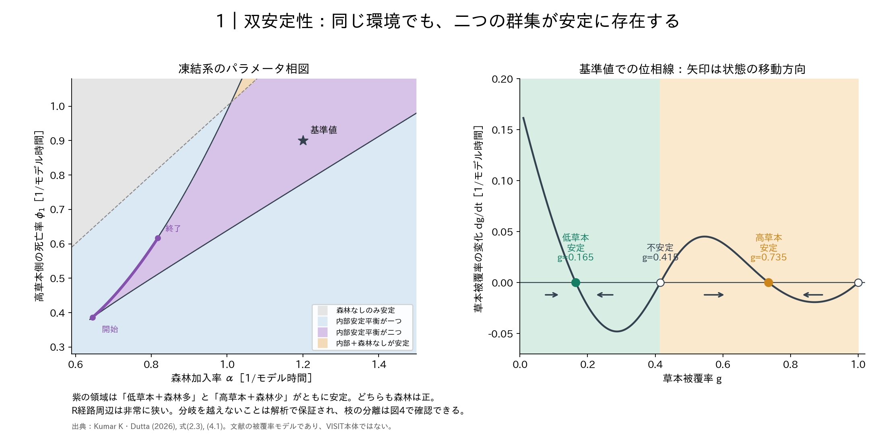
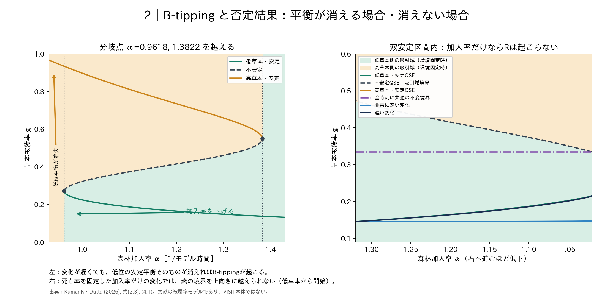
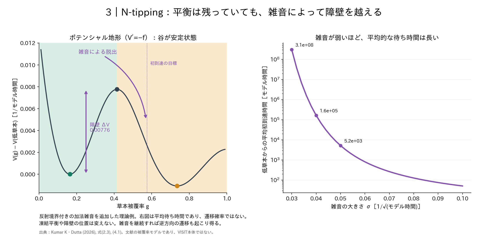
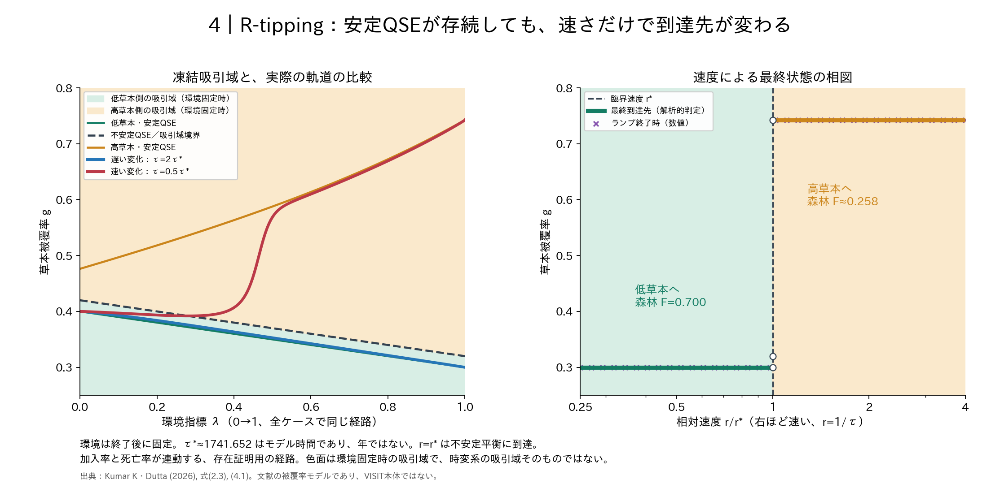
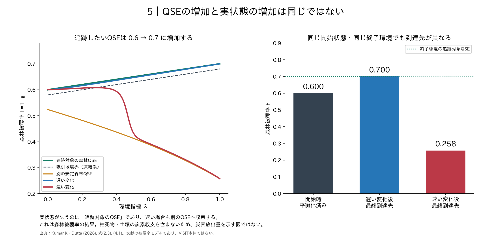

# 森林–草本競合：相図で見る双安定性と N・B・R-tipping

2026-09-30。既存の解析を可視化した図集であり、モデルの関数やパラメータ経路は変更していない。

**[5ページの図集PDFを開く](figures/forest_grass_phase_atlas/forest_grass_phase_atlas.pdf)**

数学的な条件と証明は [解析レポート](forest_grass_nbr_tipping.pdf) を参照。
文献の火災を介した被覆率モデルを使っており、VISIT本体の相図ではない。
草本被覆率 g と森林被覆率 F=1−g は、炭素貯留量とは区別する。

## 1. 双安定性が生じる環境を俯瞰する

左の横軸は森林加入率、縦軸は高草本側の森林死亡率。

- **紫**：低草本・高草本の二つの内部安定平衡。どちらも森林が残る。
- **青**：内部安定平衡が一つ。
- **灰**：森林なしの状態のみが安定。
- **薄橙**：内部安定平衡と、森林なしの状態がともに安定。
- 黒い実線は解析式による鞍点–節点分岐。灰破線は森林なしの境界状態の安定性が変わる位置。

紫の曲線はR-tippingのために構成した環境経路。分岐境界を越えない。
開始点付近の双安定領域はとても狭く、色分け用格子だけでは十分解像できない。
経路全体で平衡枝が分離していることは解析で証明しており、図4でも直接示す。

右は星印の環境での位相線。塗りつぶし点が安定、白抜き点が不安定。
黒い矢印に沿って、状態は低草本または高草本の平衡へ移動する。
被覆率 g=1 の白抜き点は、森林なしの境界平衡である。

## 2. B-tipping と「速くしても起こらない」対照

左は死亡率を固定した、加入率と状態の相図。
緑と橙は安定平衡、黒破線は不安定平衡。背景色は環境を固定したときの吸引域を示す。
加入率を下げて約0.9618を越えると、低草本平衡そのものが消える。これがB-tipping。
逆方向の分岐は約1.3822にある。図の矢印は準静的な遷移を示す模式表示であり、有限速度の軌道ではない。

右は加入率を1.32から1.02へ変える。**横軸は右ほど加入率が小さい**ので注意。
すべての時刻に共通の紫の不変境界があり、低草本から出発した状態はこれを上向きに越えられない。
非常に速い軌道も遅い軌道も同じ側に残る。
ここでのR-tippingの否定は、死亡率固定・低草本平衡開始・双安定区間内という条件付きの結果。

## 3. N-tipping は確率的な脱出として読む

左はポテンシャル地形。谷が安定平衡、山の頂が不安定平衡。
雑音がない決定論的な運動は谷へ戻るが、雑音があれば山を越える可能性がある。
紫の曲線矢印はその概念図であり、確率過程を実現した標本軌道ではない。

右は低草本平衡から、境界の先の指定した状態へ初めて達するまでの**平均待ち時間**。
解析的に導いた積分公式を評価したもので、縦軸は対数。
遷移確率や、確定的な雑音閾値を表してはいない。
被覆率0と1で反射する加法雑音を追加した理論であり、自然界の雑音強度を推定した結果ではない。
雑音をかけ続ければ、逆向きの遷移も起こり得る。

## 4. R-tipping は「同じ経路、異なる速さ」で比較する

左は環境指標と草本被覆率の相図。すべての環境で安定平衡が二つ残る。
青の遅い軌道は低草本枝を追うが、赤の速い軌道は境界を越え、高草本側へ向かう。
背景色は**その環境を固定した場合の吸引域**であり、時変系の吸引域そのものではない。

右は速度と最終到達先の相図。環境変化の終了後は環境を固定する。
横軸は臨界速度で割った相対速度であり、右ほど速い。

- 相対速度が1未満：低草本に収束し、森林被覆率は0.700。
- 相対速度が1を超える：高草本に収束し、森林被覆率は約0.258。
- ちょうど1：不安定平衡 g=0.32 に到達する。白抜き点はこの特殊な場合を含む。

緑・橙の太線は解析的に判定した長時間後の到達先。
紫の×は36通りの速度について数値計算した、環境変化が終わった時点の状態。
環境経路と始終点を固定し、時間の引き伸ばしだけを変えている。
臨界継続時間約1741.652はモデル時間であり、年や温暖化速度に換算していない。
一つの外部環境指標が加入率と死亡率の両方を変える、存在証明用の経路である。

## 5. 本来の問いに戻る：QSEが増えても、実状態が増えるとは限らない

森林側から見ると、追跡対象のQSEは0.6から0.7へ増加する。
それでも速い変化では、実際の森林被覆率が約0.258へ低下する。
初期状態と終了環境は同じなので、到達先の違いは変化速度による。

「どのQSEにも達しない」ではなく、「追跡対象を失い、別のQSEへ向かう」という結果。
枯死木・リター・土壌の炭素収支をまだ含めていないため、森林減少をそのまま炭素放出量と読まない。

## 保存と再現

各図はPNGとベクトルPDF、全体は5ページのPDFとして保存。
同じディレクトリに plot_data.json、manifest.json、source_snapshot/ を置き、
色分けの分類、数値、使用したソースとSHA-256を記録した。

~~~bash
python examples/plot_forest_grass_phase_atlas.py --output /tmp/forest_grass_phase_check
python -m pytest -q tests/test_forest_grass_tipping.py
~~~

出力先は存在しないディレクトリを指定する。既存の図や解析結果を上書きしない。
日本語フォントとしてIPAexGothic（代替：IPAGothic）が必要。
生成時に被覆率の範囲、相対速度による到達先、前進・後退の接合残差、平均脱出時間の単調性を検査。
既存の専用テスト7件も再実行し、成功した。
